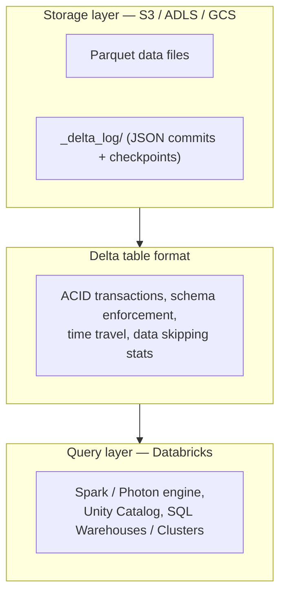

# Delta Lake on Databricks — Theory, Application, and Optimization

This is a standalone reference, not the Lecture 7–9 class script. It goes deeper into one concrete answer to the CAP-theorem tension covered in class: how a **lakehouse** (Delta Lake) buys back the consistency guarantees you'd otherwise lose by putting transactional-style logic on top of distributed object storage (S3 / ADLS / GCS), and how Databricks, as the query layer on top of that storage, gives you levers to make it fast. Techniques are ranked by typical **impact-to-effort ratio ("return")** — do the ones near the top first; they pay off on almost every table, while the ones near the bottom matter only in specific situations.

## Key Terms

- **Delta Lake**: An open storage format that adds a transaction log on top of Parquet files sitting in object storage, giving you ACID transactions, schema enforcement, and time travel on data that would otherwise be "just files."
- **Transaction log (`_delta_log`)**: A directory of ordered JSON commit files (periodically checkpointed to Parquet) that records every change to a table. This *is* the mechanism that turns eventually-consistent object storage into a strongly-consistent table.
- **Lakehouse**: The architecture pattern of running a warehouse-style query engine (Databricks SQL, Spark) directly over lake storage (Delta tables) instead of a separately-managed warehouse.
- **Photon**: Databricks' native, vectorized query engine (written in C++) that executes Spark SQL / DataFrame plans faster than the JVM engine, with no code changes.
- **Z-Ordering**: A technique that co-locates related data (rows with similar values in chosen columns) within the same set of files, so queries filtering on those columns skip more files.
- **Liquid Clustering**: Databricks' newer replacement for Z-Ordering and partitioning — an incrementally maintained clustering that avoids the "pick your partition columns once, forever" problem.
- **Data skipping**: Delta automatically records min/max statistics per file; the query planner uses these to skip reading files that can't match a filter, without you doing anything.
- **OPTIMIZE / compaction**: Rewriting many small files into fewer, right-sized files, because small files are the single biggest tax on distributed query performance.
- **VACUUM**: Physically deletes files no longer referenced by the transaction log (old versions past the retention window). Trades away time-travel history for storage cost.
- **MERGE INTO**: Delta's upsert statement (match/update/insert/delete in one atomic operation) — the standard way to apply CDC-style incremental data.
- **Change Data Feed (CDF)**: An opt-in log of row-level changes (insert/update/delete) per Delta table version, so downstream consumers can read only what changed instead of rescanning the whole table.
- **Adaptive Query Execution (AQE)**: Spark's runtime re-optimizer — it watches actual data sizes mid-query and rewrites join strategies, shuffle partition counts, and skew handling on the fly.
- **Broadcast join**: A join strategy where the smaller side of a join is sent whole to every executor, avoiding a shuffle. Only works when the small side actually fits in memory.

## 1. Theory: Why Delta Lake Exists (the CAP Tie-In)

In the main lecture, the core tension is: once you replicate data across hosts, a network partition forces you to choose between staying consistent (and refusing some requests) or staying available (and risking reading/writing stale data). Object storage systems (S3, ADLS, GCS) resolve this by leaning **available and eventually consistent** — you can list a directory of files and, historically, not be guaranteed to see every file another writer just finished uploading, and two concurrent writers can silently clobber each other's output with no coordination at all.

That's fine for "store some files." It is not fine for "here is a table three teams are reading and writing concurrently, and I need every reader to see either the state before an update or the state after — never a torn mix of both."

Delta Lake's transaction log is the fix. Every write to a Delta table doesn't just write Parquet files — it also appends a JSON entry to `_delta_log/` describing exactly which files that transaction added or removed, and it does so via an atomic, sequentially-numbered commit (`000...0.json`, `000...1.json`, …). Two concurrent writers racing to write the *next* commit number will have one of them win and one of them detect the conflict and retry. Readers only ever look at the log's latest fully-committed state, never at half-finished writes on disk. You get **snapshot isolation** and atomic multi-file commits — ACID, effectively — on top of storage that was never designed to offer any of that on its own.

The practical consequence for this course: a lakehouse table is not "just a folder of Parquet files." Every optimization technique below is really a technique for either (a) making the transaction log's job cheaper, or (b) making the query engine reading through that log and its files faster.

## 2. Architecture: The Three Layers



- **Storage layer**: cheap, durable, effectively infinite, eventually consistent on its own. This is the "distributed storage" from the main lecture — good for availability and scale, not for transactional correctness by itself.
- **Table format layer (Delta)**: the transaction log turns that storage into something with ACID guarantees, versioning, and per-file statistics.
- **Query layer (Databricks)**: the actual compute that plans and executes queries against Delta tables — Spark or Photon, running on clusters or serverless SQL warehouses, coordinated through Unity Catalog for governance.

Everything below is about tuning layer 2 and layer 3. Layer 1 (which cloud bucket you pick) barely matters for performance once you're inside a single region.

## 3. Optimization Techniques, Ranked by Return

| Rank | Technique | Effort | Typical impact | Why it's ranked here |
|---|---|---|---|---|
| 1 | File-size management (`OPTIMIZE`, Auto Optimize) | Low | Very high | Fixes the single most common cause of slow lakehouse queries: too many small files. Near-zero downside. |
| 2 | Partitioning strategy | Medium (must decide early) | Very high | Wrong partitioning is expensive to unwind on a large table; right partitioning is close to free forever after. |
| 3 | Liquid Clustering / Z-Ordering | Low–Medium | High | Directly improves data-skipping for your actual query filters, beyond what partitioning alone can do. |
| 4 | Enabling Photon | Trivial (one setting) | High on SQL/DataFrame workloads | Literally a checkbox / cluster config change; no query rewrite needed. |
| 5 | Caching (disk cache, result cache) | Low | Medium–High for repeat queries | Free speedup for dashboards/BI workloads hitting the same data repeatedly. |
| 6 | Adaptive Query Execution tuning | Low (mostly default-on) | Medium–High on skewed joins | Handles the "one partition has 1000x the data" problem automatically; worth knowing how to nudge it. |
| 7 | Join strategy (broadcast hints) | Low | Medium–High, situational | Big win on small-dimension/large-fact joins; irrelevant otherwise. |
| 8 | `MERGE INTO` optimization | Medium | Medium–High for CDC pipelines | Only matters if your workload is upsert-heavy, but decisive there. |
| 9 | `VACUUM` / retention tuning | Low | Medium (cost, not speed) | Storage-cost lever, and a prerequisite for compliance/retention policy — not a query-speed lever. |
| 10 | Change Data Feed for downstream consumers | Medium | Medium, situational | Turns "rescan the whole table" into "read the delta," but only pays off with real downstream consumers. |
| 11 | Cluster sizing / autoscaling / serverless SQL | Medium | High on cost, variable on speed | Infra lever — more about $/query than making a specific query smarter. |
| 12 | Schema evolution & enforcement discipline | Low | Correctness, not speed | Doesn't make queries faster, but prevents entire classes of pipeline breakage — cheap insurance. |

The rest of this document walks each of these in order, pairing the theory with the exact Databricks mechanism and when it actually pays off.

### 3.1 File-size management (`OPTIMIZE`, Auto Optimize)

**Theory.** Every file a query touches costs a fixed amount of overhead — opening it, reading its footer, planning around it — independent of how much data is inside. A table backed by thousands of tiny files (a classic outcome of frequent small streaming writes) forces the query engine to pay that fixed cost thousands of times over. Delta's data-skipping statistics also get *less* useful as files get smaller and more numerous, because there's more bookkeeping and less to skip.

**Applied in Databricks.**
```sql
-- Manually compact a table's files into fewer, larger ones
OPTIMIZE sales.transactions;

-- Compact only files touching recent partitions (much cheaper on huge tables)
OPTIMIZE sales.transactions WHERE event_date >= '2026-07-01';
```
```sql
-- Turn on automatic compaction so you rarely need to run OPTIMIZE by hand
ALTER TABLE sales.transactions SET TBLPROPERTIES (
  delta.autoOptimize.optimizeWrite = true,
  delta.autoOptimize.autoCompact = true
);
```

**Return.** This is the highest-ROI lever in the entire list. It requires no schema change, no query rewrite, and typically cuts scan times dramatically on any table fed by frequent small writes (streaming ingestion, many small batch jobs). Run it on a schedule (nightly, or after each streaming micro-batch window) rather than only when things feel slow.

### 3.2 Partitioning strategy

**Theory.** Partitioning splits a table into subdirectories by column value (e.g., by date), so a query with a matching filter can skip entire subdirectories without even opening a file. The classic failure mode is over-partitioning: partitioning by a high-cardinality column (e.g., `user_id`) produces enormous numbers of tiny partitions, which recreates the small-file problem from 3.1 at the directory level *and* slows down the driver, which has to plan around every partition.

**Applied in Databricks.**
```sql
CREATE TABLE sales.transactions (
  event_date DATE,
  region STRING,
  amount DOUBLE
)
USING DELTA
PARTITIONED BY (event_date);   -- good: low-cardinality, matches common filters
```
Rule of thumb: partition columns should (a) appear in most query filters, (b) have low-to-moderate cardinality, and (c) each partition should hold at least ~1 GB of data after compaction. If you're partitioning by something with thousands of distinct values, use clustering (3.3) instead.

**Return.** Getting this right at table-creation time is close to free. Getting it wrong on a table that's already grown large is expensive to fix — you have to rewrite the entire table under a new partition scheme. This is why it ranks above clustering: it's a one-time decision with an outsized long-term cost if made wrong early.

### 3.3 Liquid Clustering / Z-Ordering

**Theory.** Partitioning only helps columns you partitioned by. Z-Ordering co-locates rows by *additional* columns within files, so data-skipping also works for filters on those columns, without creating more directories. Liquid Clustering (Databricks' newer feature) achieves the same goal but is maintained incrementally as data is written, rather than requiring you to periodically re-run a clustering job — and it doesn't lock you into partition columns chosen at table-creation time.

**Applied in Databricks.**
```sql
-- Z-Ordering: run periodically, typically alongside OPTIMIZE
OPTIMIZE sales.transactions
ZORDER BY (customer_id, region);
```
```sql
-- Liquid Clustering: declared once, maintained automatically on every write
CREATE TABLE sales.transactions (
  event_date DATE,
  customer_id STRING,
  region STRING,
  amount DOUBLE
)
USING DELTA
CLUSTER BY (customer_id, region);
```

**Return.** High, especially for tables queried on more than one filter pattern (e.g., sometimes by date, sometimes by customer). Liquid Clustering is the better default on new tables since it removes the operational burden of remembering to re-run `ZORDER`, and it tolerates changing query patterns without a table rebuild.

### 3.4 Enabling Photon

**Theory.** Photon re-implements Spark's execution engine in native, vectorized code, avoiding JVM object overhead per row. It's a drop-in replacement for the execution layer — your SQL and DataFrame code doesn't change.

**Applied in Databricks.** Enable it at the cluster or SQL warehouse level (a checkbox in cluster configuration, or the default on newer Databricks SQL warehouses). No query changes required.

**Return.** High and essentially free for SQL-heavy and DataFrame-heavy workloads (aggregations, joins, scans). Gains are smaller for workloads dominated by user-defined Python/Scala functions that Photon can't accelerate — check whether your bottleneck is a UDF before expecting a win here.

### 3.5 Caching (disk cache, result cache)

**Theory.** Databricks' disk cache keeps recently-read remote files on local cluster SSD, so repeated scans of the same data skip the network round-trip to object storage. Separately, Databricks SQL warehouses cache full query *results*, so an identical repeated query returns instantly.

**Applied in Databricks.** Disk cache is on by default on most cluster types — no code needed, but it's worth knowing it exists so you don't assume every "warm" query re-reads from S3. For explicit control:
```sql
CACHE SELECT * FROM sales.transactions WHERE event_date = current_date();
```

**Return.** Medium-to-high specifically for repeat-heavy access patterns: BI dashboards, iterative notebook exploration, and any workload where the same table gets scanned by many similar queries in a session. Negligible for one-off queries over data no one revisits.

### 3.6 Adaptive Query Execution (AQE) tuning

**Theory.** Spark plans a query using estimated statistics before running it. Estimates are often wrong, especially for skewed data (one join key with far more rows than the rest). AQE re-checks actual sizes at runtime and can switch join strategies, split skewed partitions, or coalesce small shuffle partitions after the fact.

**Applied in Databricks.** On by default in current Databricks runtimes. Key knobs when the default isn't enough:
```python
spark.conf.set("spark.sql.adaptive.enabled", "true")
spark.conf.set("spark.sql.adaptive.skewJoin.enabled", "true")
spark.conf.set("spark.sql.adaptive.coalescePartitions.enabled", "true")
```

**Return.** Medium-to-high specifically when you have skewed join keys (a small number of keys with disproportionately many rows — a classic real-world pattern, e.g. one `customer_id` representing a shared/test account with millions of rows). Verify it's doing its job by checking the Spark UI's query plan for "skew" annotations on join stages.

### 3.7 Join strategy — broadcast hints

**Theory.** A shuffle join redistributes both sides of a join across the cluster by key — expensive. If one side is small enough to fit comfortably in memory, broadcasting it to every executor avoids the shuffle on the large side entirely.

**Applied in Databricks.**
```python
from pyspark.sql.functions import broadcast

result = large_fact_df.join(broadcast(small_dimension_df), "region_id")
```
AQE will often broadcast automatically once it sees the small side's actual size at runtime — the explicit hint matters most when you know the size ahead of AQE's own estimate, or want to force the behavior deterministically.

**Return.** Medium-to-high, but situational — decisive on star-schema-style fact/dimension joins, irrelevant on joins between two genuinely large tables (where you instead want a well-chosen shuffle partition count, or a sort-merge join).

### 3.8 `MERGE INTO` optimization

**Theory.** `MERGE INTO` is how you apply upserts (CDC-style incremental updates) to a Delta table. A naive merge scans the *entire* target table to find matches. The fix is to give the merge condition something to prune on — usually the same partition or clustering columns from 3.2/3.3 — so it only scans the files that could plausibly match.

**Applied in Databricks.**
```sql
MERGE INTO sales.transactions AS target
USING updates AS source
ON target.event_date = source.event_date   -- partition-aligned predicate: enables file pruning
   AND target.transaction_id = source.transaction_id
WHEN MATCHED THEN UPDATE SET *
WHEN NOT MATCHED THEN INSERT *;
```

**Return.** Medium-to-high, and specifically decisive for streaming/CDC ingestion pipelines that run frequent merges against a large target table. Without a pruning predicate, merge cost grows with total table size; with one, it grows with the size of the touched partition only.

### 3.9 `VACUUM` and retention tuning

**Theory.** Every write to a Delta table can leave old file versions around (that's what enables time travel). `VACUUM` deletes files older than the retention window that are no longer referenced by the current table state.

**Applied in Databricks.**
```sql
-- Default retention is 7 days; shortening it is possible but disables time travel beyond that window
VACUUM sales.transactions RETAIN 168 HOURS;
```

**Return.** Medium, but on the cost axis, not the speed axis — this controls storage spend and compliance-driven data deletion, not query performance. Rank it above CDF/cluster sizing because nearly every production table needs *some* retention policy decided deliberately, even if the decision is "keep the default."

### 3.10 Change Data Feed (CDF) for downstream consumers

**Theory.** Without CDF, a downstream job that needs "what changed since last time" has to diff full table snapshots or rescan everything. CDF exposes an explicit per-version log of inserted/updated/deleted rows.

**Applied in Databricks.**
```sql
ALTER TABLE sales.transactions SET TBLPROPERTIES (delta.enableChangeDataFeed = true);
```
```python
changes = (spark.read.format("delta")
    .option("readChangeFeed", "true")
    .option("startingVersion", 42)
    .table("sales.transactions"))
```

**Return.** Medium, and situational — high payoff specifically when there's a real downstream consumer (another pipeline, a reverse-ETL job, an ML feature store) that would otherwise rescan the whole table on every run. No benefit if nothing downstream needs incremental reads.

### 3.11 Cluster sizing, autoscaling, and serverless SQL

**Theory.** More/bigger compute makes any given query faster, up to the point where the query is no longer compute-bound (e.g., it's bound by a small number of skewed partitions, or by small-file overhead). Throwing cluster size at a problem that's actually a 3.1–3.3 problem wastes money without fixing the root cause.

**Applied in Databricks.** Autoscaling clusters and serverless SQL warehouses both let compute scale to the query rather than sizing for a static worst case. Right-size based on the Spark UI's stage timings, not guesswork.

**Return.** High impact on cost efficiency, and it does directly affect wall-clock speed — but check the techniques above first. A well-compacted, well-clustered table on a small cluster often outperforms a poorly-organized table on a large one, at a fraction of the cost.

### 3.12 Schema evolution and enforcement discipline

**Theory.** Delta enforces schema by default (a write with an unexpected column fails loudly) but can be told to evolve the schema automatically when that's actually intended. Getting this switch wrong in either direction either breaks pipelines on legitimate upstream changes, or silently accepts malformed data.

**Applied in Databricks.**
```python
(df.write.format("delta")
   .option("mergeSchema", "true")   # explicit opt-in to evolve, not a default
   .mode("append")
   .saveAsTable("sales.transactions"))
```

**Return.** Doesn't speed up queries, but it's the cheapest insurance against an entire category of production incidents — a silently changed upstream schema corrupting a table, or a legitimate new column getting rejected and blocking a pipeline. Decide this deliberately per table rather than defaulting to "always allow evolution."

## 4. Putting It Together: A Worked Example

A `sales.transactions` table fed by a streaming job, queried by dashboards filtering on `event_date` and occasionally `customer_id`:

1. Partition by `event_date` (3.2) — matches the most common filter, low cardinality.
2. Enable Auto Optimize (3.1) so the small files the streaming job produces get compacted continuously.
3. Add Liquid Clustering on `customer_id` (3.3) to make the occasional customer-level query fast too, without needing a second partition dimension.
4. Turn on Photon on the SQL warehouse serving the dashboards (3.4) — free win, no code change.
5. Leave AQE on defaults (3.6) — it will handle any skew from disproportionately active customers automatically.
6. Set a deliberate `VACUUM` retention policy (3.9) matching whatever compliance window applies.

Everything else on the list (broadcast hints, CDF, explicit cluster sizing) gets added only if a specific, observed bottleneck calls for it — not by default.
